```{=html}
<style>
:root{ --acc:#0f766e; --acc2:#cf5b3c; }
.reveal h1,.reveal h2,.reveal h3{ color:#15323a; }
.reveal h2{ border-bottom:3px solid var(--acc); padding-bottom:.15em; }
.reveal strong{ color:var(--acc); }
.reveal .em2{ color:var(--acc2); font-weight:700; }
.reveal section img{ border-radius:8px; }
.reveal pre code{ font-size:.78em; }
.reveal .small{ font-size:.8em; }
.reveal .smaller{ font-size:.68em; color:#5d6b6b; }
.reveal table{ font-size:.72em; }
.reveal .shot img, .reveal video.shot{ border:1px solid #d8e0e0; border-radius:8px; box-shadow:0 3px 14px rgba(0,0,0,.10); }
.reveal video.shot{ display:block; margin:.2em auto 0; }
.reveal .live{ display:inline-block; background:var(--acc2); color:#fff; font-weight:700;
  border-radius:4px; padding:.02em .45em; font-size:.6em; vertical-align:middle; margin-left:.3em; }
.reveal figcaption{ font-size:.6em; color:#5d6b6b; }
.reveal .step{ display:inline-block; background:var(--acc); color:#fff; font-weight:700;
  border-radius:999px; padding:.05em .6em; font-size:.7em; margin-right:.4em; }
</style>
```

## Roteiro {.smaller}

1.  **Apresentação da ferramenta** — o que é o Biblioshiny
2.  **Aplicações na pesquisa** — onde entra no ciclo da pesquisa
3.  **Funcionalidades principais** — o que ele calcula
4.  **Configuração inicial** — acesso, requisitos e formatos
5.  **Fluxo de uso** — Input → Processo → Review → Output
6.  **Exemplos reais** — estudo de caso ao vivo
7.  **Formações** — onde aprender mais
8.  **Limitações e riscos** — gargalos técnicos e metodológicos
9.  **Boas práticas** — rastreabilidade e reprodutibilidade
10. **Atividade com solução** — sua vez de explorar
11. **Referências**

::: notes
Apresentar-se, dizer que ao final cada um vai rodar a própria instância. Tempo-alvo: 25–30 min + prática.
:::

# 1 · Apresentação da Ferramenta

## Contexto científico {.smaller}

A **bibliometria** e o ***science mapping*** transformam **metadados de milhares de artigos** em um mapa quantitativo, transparente e **reproduzível**, respondendo a:

- Como o campo **evoluiu** no tempo?
- Quem são os **autores, periódicos e países** centrais?
- Quais os **temas** e como eles se conectam e mudam?
- Qual a **estrutura intelectual** (quem cita quem)?

## A ferramenta: bibliometrix → biblioshiny {.smaller}

**bibliometrix (2017)** — pacote em **R** de **Massimo Aria** e **Corrado Cuccurullo** (*Journal of Informetrics*, 11(4), 959–975). Reúne, de forma **aberta e gratuita**, todo o fluxo de análise bibliométrica que antes exigia várias ferramentas isoladas. Importa de **Scopus, Web of Science, Dimensions, OpenAlex, Lens, PubMed e Cochrane**.

**O "porém":** o `bibliometrix` exigia **escrever código em R** — uma barreira para quem não programa.

## Valor agregado: o biblioshiny {.smaller}

Uma aplicação **web (Shiny)** que coloca uma **interface gráfica** sobre o mesmo motor do `bibliometrix`:

- Mesmíssimas análises — agora **clicando**, sem escrever uma linha de código.
- Importar, filtrar, analisar e visualizar; exportar tabelas, gráficos e relatórios.

> Cada **botão** do Biblioshiny corresponde a uma **função** do `bibliometrix`. Quem entende o código entende o que cada tela calcula.

# 2 · Aplicações na Pesquisa

## O modelo SAAS {.smaller}

O Biblioshiny é organizado em torno do **fluxo SAAS** — uma reformulação do framework SALSA (Grant & Booth, 2009):

| Etapa         | O que faz                      | Seção do artigo      |
|---------------|--------------------------------|----------------------|
| **S**earch    | Buscar e importar o corpus     | Métodos              |
| **A**ppraisal | Avaliar/filtrar e descrever    | Métodos / Resultados |
| **A**nalysis  | Mapear estrutura e indicadores | Resultados           |
| **S**ynthesis | Interpretar e narrar           | Discussão            |

Cada etapa **mapeia para uma seção de um artigo científico** → análise transparente e **reproduzível** de ponta a ponta.

## Onde se encaixa no ciclo da pesquisa {.smaller}

- **Revisão sistemática / de literatura** — corpus rastreável, critérios documentados.
- **Bibliometria e science mapping** — estrutura conceitual, intelectual e social de um campo.
- **Análise de corpus** — texto completo, palavras-chave, *trend topics*.

Onde o projeto está hoje:

- Integração via **API** (OpenAlex, PubMed) — baixa os dados direto, sem exportar arquivo.
- **Análise de texto completo**: função das citações, extração de palavras-chave (TF-IDF, RAKE, YAKE), estrutura IMRaD.
- **Biblio AI**: assistente de IA integrado para ajudar a **interpretar** os resultados.

# 3 · Funcionalidades Principais

## Seis blocos de funcionalidades {.smaller}

- Importação e tratamento de dados
- Análise descritiva geral (Overview)
- Análise de fontes (Sources)
- Análise de autores (Authors)
- Análise de documentos (Documents)
- Visualizações e relatórios

## No panorama das ferramentas {.smaller}

::::: columns
::: {.column width="42%"}
Comparativo de ferramentas de *science mapping*:

- **BiblioShiny** e a lib **Bibliometrix** cobrem praticamente **todas as features** — redes temática/autor/referência, evolução, performance e mapa geográfico.
- **VOSviewer** e **CiteSpace** são mais **especializados** (poucas colunas marcadas).
- Vantagem extra: o mesmo motor em **código** (`bibliometrix`) e **interface** (Biblioshiny).
:::

::: {.column width="58%"}
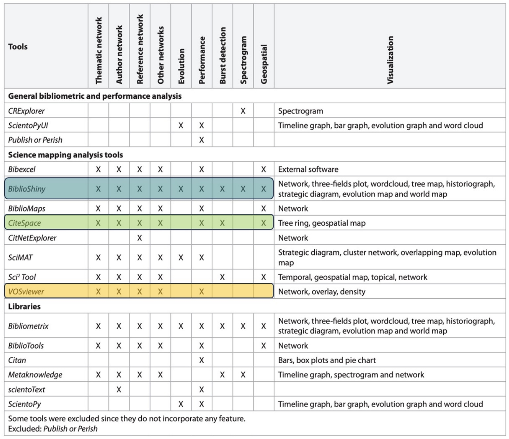{.shot width="92%" fig-align="center"}
:::
:::::

# 4 · Configuração Inicial

## Acesso, requisitos e formatos {.smaller}

- **Acesso / login** — roda no **Hugging Face Spaces**: cada um duplica a instância para a sua conta (gratuita) e abre pelo navegador, sem instalar nada.
- **Requisitos técnicos** — só o navegador atualizado; o Space já traz R + `bibliometrix` pré-instalados (também roda em **R/RStudio local**).
- **Formatos aceitos** — exportações de **Scopus, WoS, OpenAlex, Lens, Dimensions, PubMed, Cochrane** (`.bib`, `.txt`, `.csv`) ou import direto por **API**.
- **Configurações** — idioma da interface, filtros do corpus e escolha de hardware (deixe **CPU basic (free)**).

## Instalação (uma vez por sessão) {.smaller}

```{r}
# Instalação no R local (no Hugging Face já vem pré-instalado)
install.packages(c("bibliometrix", "bibliometrixData"))

library(bibliometrix)
```

```{r}
# Corpus de exemplo já incluído (sem precisar baixar nada)
data(management, package = "bibliometrixData")
M <- management

dim(M)                       # documentos x campos
range(M$PY, na.rm = TRUE)    # intervalo de anos
```

::: notes
Aqui troco para execução ao vivo no notebook. Mostrar o tamanho do corpus.
:::

## Subindo a interface {.smaller}

```{r}
library(bibliometrix)
biblioshiny()        # sobe a interface web no navegador
```

**No R local** o `biblioshiny()` abre numa aba do navegador. **No Hugging Face** nem isso: a sua cópia do Space *já é* a interface — basta abrir a URL.

::: em2
Pegadinha do Space gratuito: ele **"dorme" após 48h** sem uso (acorda sozinho no próximo acesso) e o armazenamento é **temporário** — exporte seus resultados antes de fechar.
:::

::: notes
Aqui paro de falar e ABRO o biblioshiny ao vivo. Mostro a tela inicial e o menu lateral.
:::

# 5 · Fluxo de Uso

## Input → Processo → Review → Output {.smaller}

| Etapa | No Biblioshiny | No bibliometrix (código) |
|----|----|----|
| **1 · Input** | Data → Import or Load **ou** API (OpenAlex/PubMed) | `convert2df()` |
| **2 · Processo** | Appraisal: completar/filtrar; Analysis: rodar | `biblioAnalysis()` + `summary()` |
| **3 · Review** | Conferir tabelas, completude e filtros | inspeção do `data.frame` |
| **4 · Output** | Exportar tabelas, gráficos e relatórios | `plot()`, *report* |

A seguir, o fluxo real na interface: **buscar → limpar → analisar**.

## Etapa 1 · Duas portas de entrada {.smaller}

::::: columns
::: {.column width="50%"}
**a) Importar arquivo (lib padrão)** `Data → Import or Load` — exportações de Scopus, WoS, Lens, Dimensions, PubMed, Cochrane.

Data → Import or Load → Use a sample collection → escolhe o dataset e clica Start.

<video src="img/vid1-import.mp4" data-autoplay loop muted playsinline class="shot" style="width:72%">

</video>
:::

::: {.column width="50%"}
**b) Coletar por API** `Data → API → OpenAlex / Pubmed` — baixa direto, sem exportar arquivo.

Mesma classe de saída (`bibliometrixDB`); o restante do fluxo é idêntico.

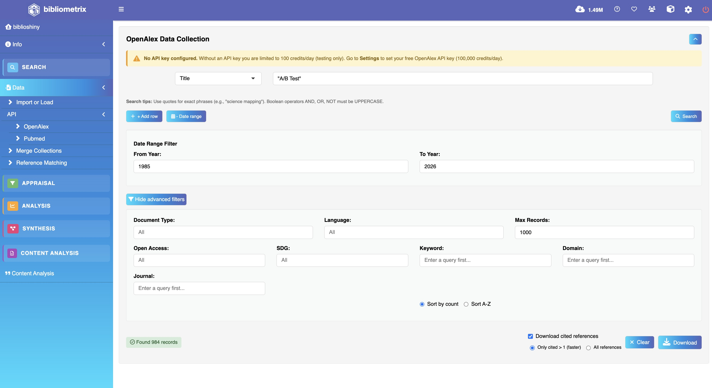{.shot width="80%" fig-align="center"}
:::
:::::

Uma função (`convert2df`) padroniza **sete bases diferentes** num único *data frame*.

## Import ao vivo — lib padrão [ao vivo]{.live} {.smaller}

`Data → Import or Load → Use a sample collection` → escolhe o dataset e clica **Start**.

<video src="img/vid1-import.mp4" data-autoplay loop muted playsinline class="shot" style="width:72%">

</video>

## Etapa 2 · Limpar: completude dos metadados {.smaller}

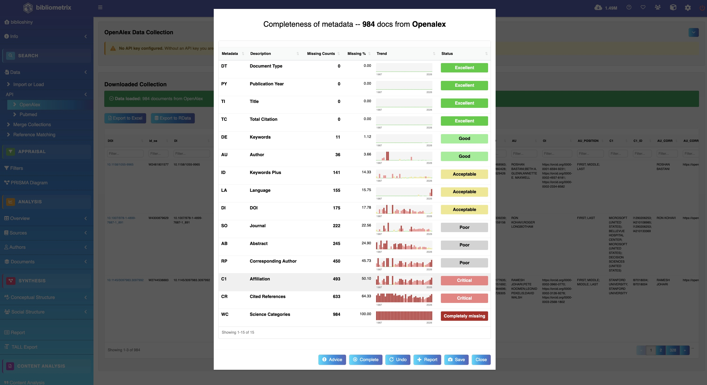{.shot width="74%" fig-align="center"}

## Por que limpar importa {.smaller}

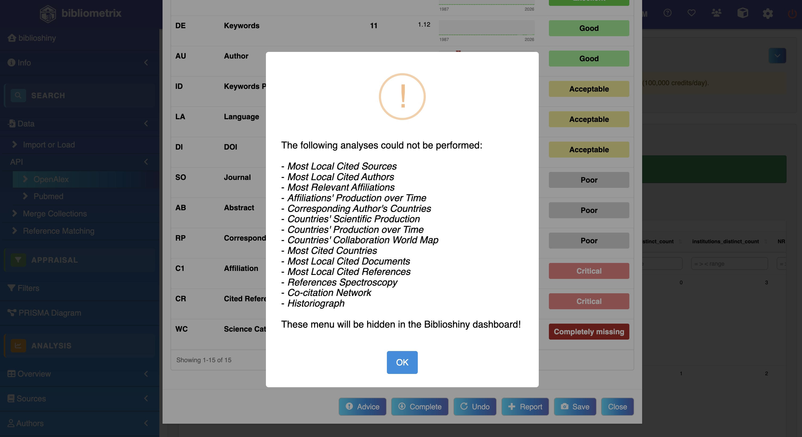{.shot width="58%" fig-align="center"}

## Etapa 2 · Completar via DOI (Crossref) {.smaller}

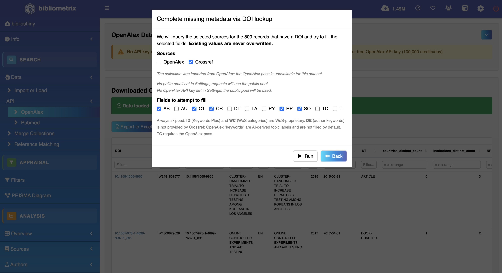{.shot width="62%" fig-align="center"}

## Etapa 2 · Enriquecimento — antes/depois {.smaller}

::::: columns
::: {.column width="50%"}
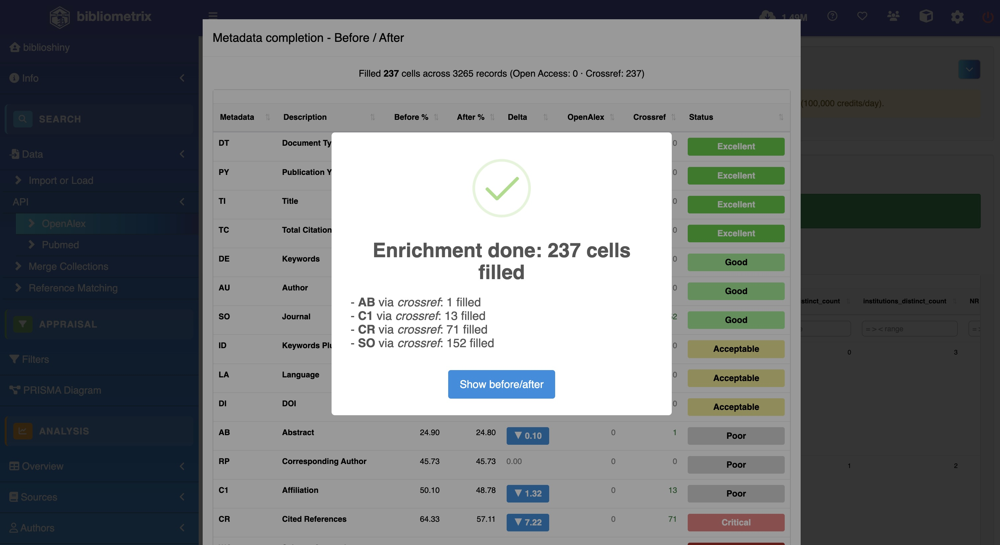{.shot width="100%"}
:::

::: {.column width="50%"}
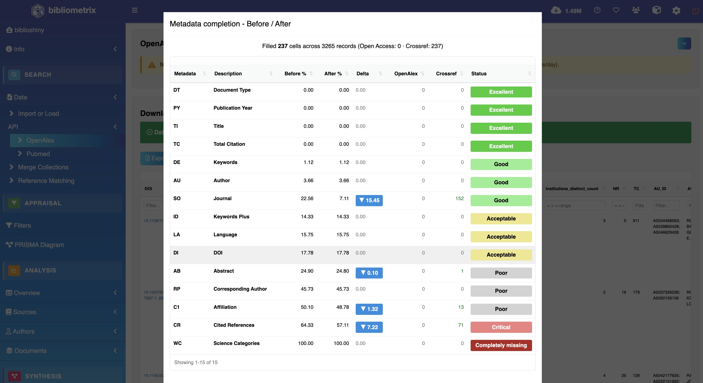{.shot width="100%"}
:::
:::::

Corpus limpo e enriquecido → pronto para a **análise**.

# 6 · Exemplos Reais

## Estudo de caso {.smaller}

**Objetivo:** mapear a estrutura de um campo a partir dos metadados.

**Base utilizada:** corpus real **"A/B Testing"** — 984 documentos coletados do **OpenAlex** (mostrado na interface); no código, usamos o corpus de exemplo `management` (`bibliometrixData`).

**Resultado:** indicadores descritivos, leis bibliométricas, índices de impacto e mapas de estrutura — sempre com a **mesma função** por trás de cada tela.

## Visão geral — Main Information {.smaller}

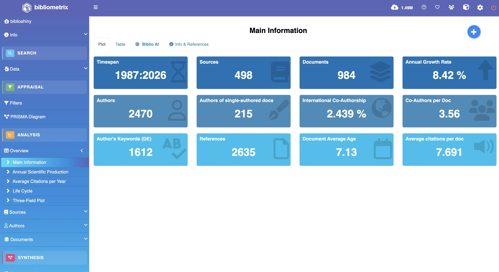{.shot width="78%" fig-align="center"}

## Visão geral — no código {.smaller}

```{r}
results <- biblioAnalysis(M, sep = ";")
S <- summary(results, k = 10, pause = FALSE, verbose = FALSE)

S$MainInformationDF   # documentos, autores, período, crescimento anual, citações...
```

A tela *Main Information* é exatamente a saída de `biblioAnalysis()` + `summary()`.

## Tour pela Overview [ao vivo]{.live} {.smaller}

Um clique em cada item do menu já devolve o gráfico — *Average Citations → Life Cycle → Three-Field*.

<video src="img/vid2-overview.mp4" data-autoplay loop muted playsinline class="shot" style="width:80%">

</video>

## Evolução temporal {.smaller}

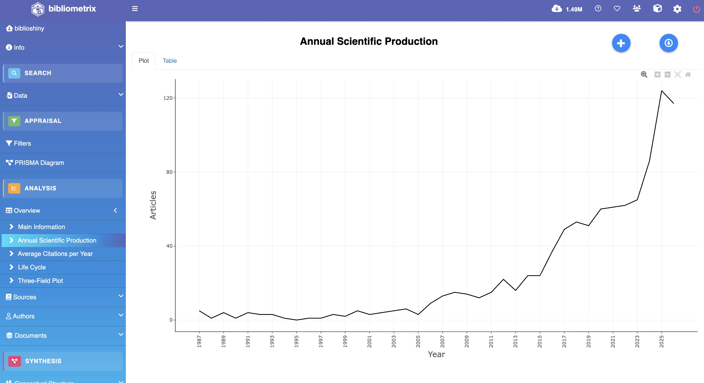{.shot width="42%" fig-align="center"}

```{r}
plot(results, k = 10, pause = FALSE)   # produção anual, países, autores...
```

## Ciclo de vida do campo {.smaller}

::::: columns
::: {.column width="50%"}
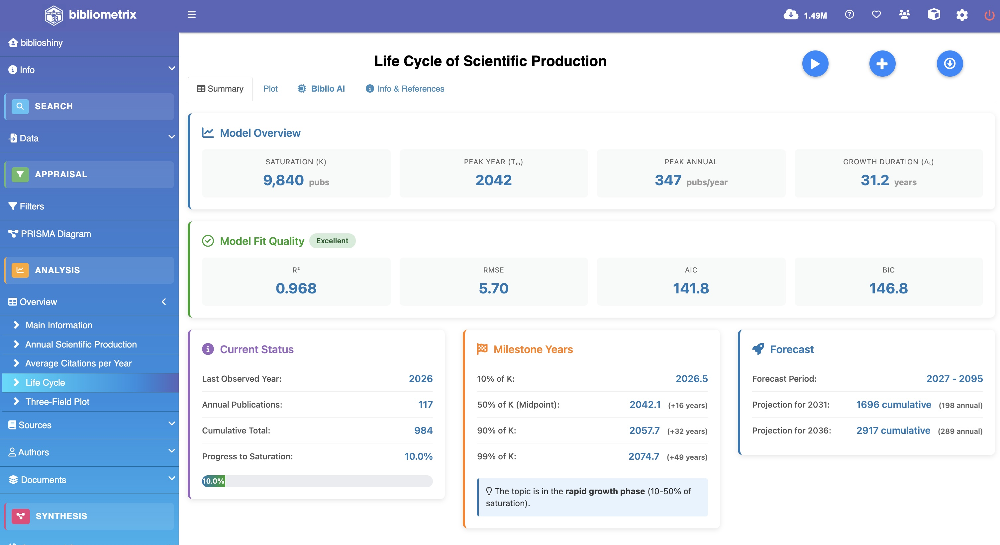{.shot width="100%"}
:::

::: {.column width="50%"}
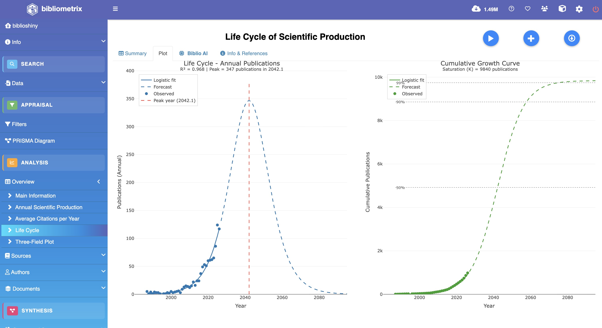{.shot width="100%"}
:::
:::::

O *Life Cycle* mostra se o campo está em **ascensão, maturidade ou declínio**.

## Periódicos — Most Relevant Sources {.smaller}

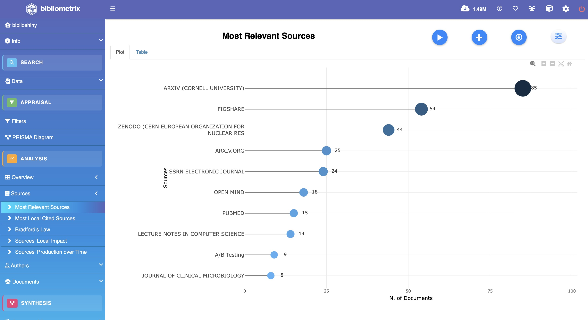{.shot width="44%" fig-align="center"}

```{r}
bradford(M)$table     # Lei de Bradford: zona "Core" = núcleo de periódicos
```

## Fontes ao vivo [ao vivo]{.live} {.smaller}

*Most Relevant Sources → Bradford's Law → Sources' Production over Time* — tudo no menu **Sources**.

<video src="img/vid3-sources.mp4" data-autoplay loop muted playsinline class="shot" style="width:80%">

</video>

## Autores e a Lei de Lotka {.smaller}

```{r}
L <- lotka(M)         # versão atual recebe M (classe bibliometrixDB)
L$AuthorProd          # nº de autores por nº de artigos
L$Beta                # ~2 => segue o padrão clássico de concentração
```

**Lotka:** poucos autores publicam muito; muitos publicam pouco. Na interface: *Authors → Lotka's Law*.

## Autores mais relevantes {.smaller}

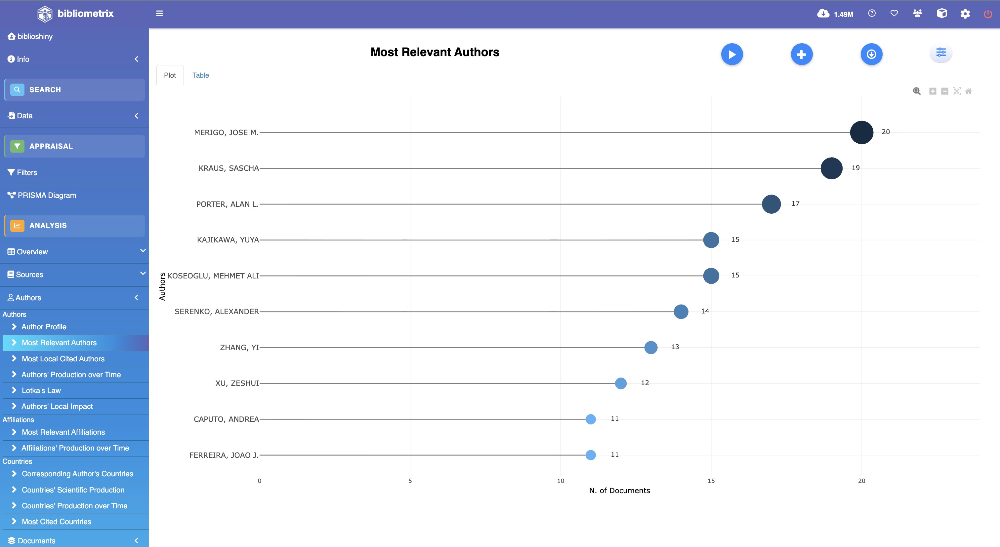{.shot width="74%" fig-align="center"}

## Impacto: índices h, g e m {.smaller}

```{r}
autores <- gsub(",", " ", names(results$Authors)[1:10])
Hindex(M, field = "author", elements = autores, sep = ";")$H
```

- **h**: equilíbrio entre volume e impacto
- **g**: dá peso aos muito citados
- **m**: corrige o h pelo tempo de carreira

## Documentos mais citados {.smaller}

```{r}
citations(M, field = "article", sep = ";")$Cited
```

As referências mais citadas costumam ser os **clássicos** que sustentam o campo. Na interface: *Documents → Most Cited*.

## Three-Field Plot {.smaller}

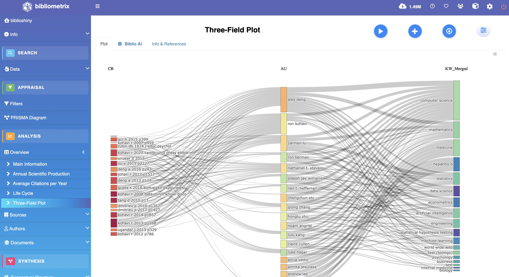{.shot width="44%" fig-align="center"}

```{r}
threeFieldsPlot(M, fields = c("AU", "DE", "SO"), n = c(20, 20, 20))
```

## Estrutura social — produção por país {.smaller}

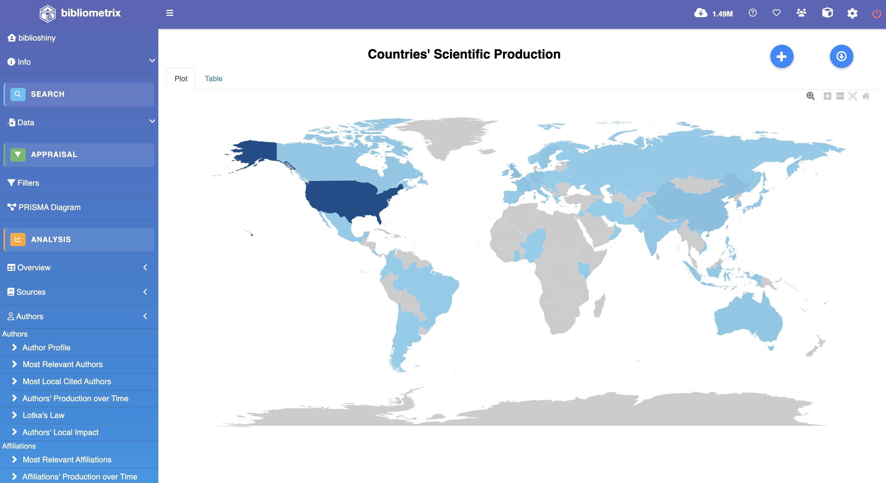{.shot width="78%" fig-align="center"}

## Estrutura intelectual — Co-citation {.smaller}

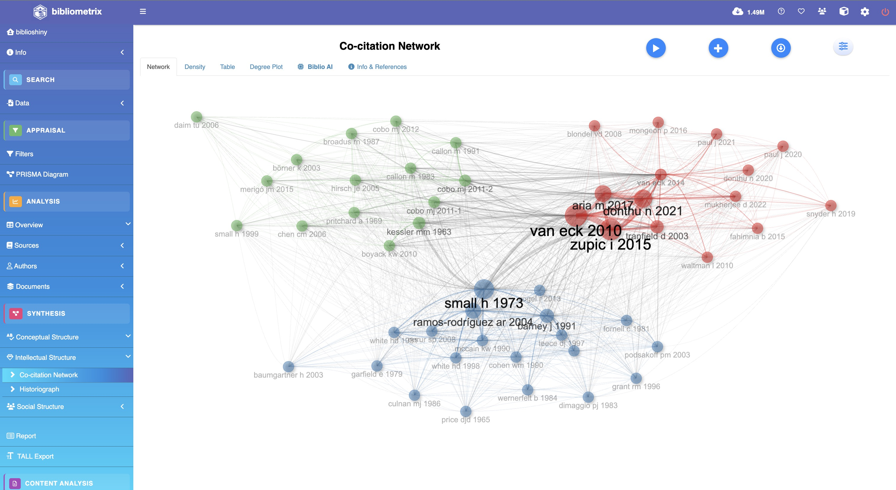{.shot width="64%" fig-align="center"}

## Estruturas ao vivo [ao vivo]{.live} {.smaller}

*Social Structure* (colaboração, mapa de países) → *Intellectual* (co-citação) → *Conceptual* (**mapa temático**).

<video src="img/vid4-structures.mp4" data-autoplay loop muted playsinline class="shot" style="width:80%">

</video>

# 7 · Formações

## Onde aprender mais {.smaller}

**Cursos livres**

- Tutoriais oficiais em **bibliometrix.org** e canal **K-Synth** (YouTube).
- Vídeos e *workshops* de bibliometria em plataformas abertas (YouTube, Coursera).

**Cursos formais**

- Disciplinas de **métodos de pesquisa / cienciometria** em programas de pós-graduação.
- *Workshops* dos autores e da comunidade `bibliometrix`.

**Material de referência**

- Livro (2026): *Science Mapping Analysis — A Primer with Biblioshiny* (McGraw-Hill).
- **Cheat sheet** da disciplina como mapa de bolso.

# 8 · Limitações e Riscos

## Gargalos técnicos e riscos metodológicos {.smaller}

**Gargalos técnicos**

- Qualidade e **cobertura das bases** (cada uma indexa um recorte diferente).
- **Duplicatas** e campos faltantes ao mesclar exportações.
- **Desambiguação de autores/afiliações** ainda exige conferência manual.

**Riscos metodológicos**

- Vieses de algoritmo e de seleção do corpus; **falsos positivos** em redes.
- **Biblio AI** pode **alucinar** — a interpretação final é sempre humana.
- Indicadores fora de contexto enganam → necessidade crítica de **validação por especialista**.

# 9 · Boas Práticas

## Limpe o corpus antes de analisar {.smaller}

> Nenhum indicador é confiável se o corpus estiver sujo. Antes de qualquer análise, duas correções valem mais que qualquer técnica sofisticada — e o Biblioshiny faz as duas:

- 🧹 **Remover duplicados** — para não inflar as contagens.
- 🧩 **Completar metadados** — para não bloquear análises.

## Remover duplicados {.smaller}

- **Problema:** o mesmo artigo aparece mais de uma vez (busca repetida, junção de bases) → infla nº de documentos, autores e citações e **distorce as redes**.
- **Na interface:** o Biblioshiny remove duplicados na importação / em *Filters*, por **DOI** ou por **título**.
- **No código:**

```r
M <- duplicatedMatching(M, Field = "TI", tol = 0.95)   # ou Field = "DOI"
```

- **Boa prática:** deduplique **logo após importar**, antes de calcular qualquer indicador.

## Completar metadados {.smaller}

- **Problema:** campos vazios (afiliação, país, referências citadas) **bloqueiam análises inteiras** — os menus correspondentes somem do painel.
- **Na interface:** *Complete missing metadata via DOI lookup* consulta **Crossref/OpenAlex** e preenche os vazios — **valores existentes nunca são sobrescritos**.
- **Verifique:** a tela de **completude** mostra, campo a campo, o % de ausentes (de *Excellent* a *Completely missing*).
- **Boa prática:** complete e **reveja a completude** antes de tirar conclusões.

# 10 · Atividade com Solução

## Sua vez — enunciado {.smaller}

- **Objetivo:** sair sabendo **ler** um mapa científico — e **reproduzi-lo**.
- **Contexto:** um campo de pesquisa representado por seus metadados.
- **Base utilizada:** sample collection **Management** embutida no Biblioshiny — WoS, 1985–2020 (ou importe o seu export do Scopus/WoS/Lens).

**Procedimentos esperados**

1.  Crie uma conta (gratuita) no [**Hugging Face**](https://huggingface.co/join).
2.  Clique no botão **Duplicate this Space** (abaixo / link no chat) → deixe o hardware em **CPU basic (free)** → **Duplicate Space**. A primeira *build* leva alguns minutos.
3.  Abra a **sua** cópia → em *Import or Load* escolha **"Use a sample collection"** → dataset **Management** → **Start** (ou suba o seu export).
4.  **Confira um indicador** na interface (ex.: nº de documentos, top autores) em *Overview → Main Information*.

[](https://huggingface.co/spaces/mrcsvg/ppgcd-biblioshiny?duplicate=true)

## Sua vez — solução comentada {.smaller}

**Produto esperado:** o dataset Management carregado na sua cópia do Biblioshiny e um indicador lido na interface.

**Critérios de verificação:** o número da tela (ex.: nº de documentos, top autores) corresponde ao corpus carregado.

**Solução comentada:**

- **Import or Load → "Use a sample collection" → Management → Start** → carrega o corpus de exemplo (Etapa 1 · Input) — o `convert2df()` roda por baixo dos panos.
- **Overview → Main Information** → indicadores descritivos (Etapa 2 · Processo / Etapa 3 · Review).
- Confira que o nº de documentos e o intervalo de anos batem com o corpus carregado.
- Use o **cheat sheet** como mapa de bolso para localizar cada análise.

# 11 · Referências

## Referências {.smaller}

::: smaller
Aria, M. & Cuccurullo, C. (2017). *bibliometrix: An R-tool for comprehensive science mapping analysis.* Journal of Informetrics, 11(4), 959–975.

Aria, M. & Cuccurullo, C. (2026). *Science Mapping Analysis: A Primer with Biblioshiny.* McGraw-Hill.

Grant, M. J. & Booth, A. (2009). *A typology of reviews (SALSA framework).* Health Information & Libraries Journal, 26(2), 91–108.

UFPR. *Normas para Trabalhos Acadêmicos: PPGCD.* Curitiba, 2024.

Site: bibliometrix.org · Interface: `biblioshiny()`
:::

## Obrigado! {.center}

**Perguntas?**

::: smaller
Guia Técnico de Uso — Biblioshiny · PPGCD/UFPR · Mestrado Profissional em Ciência de Dados
:::
